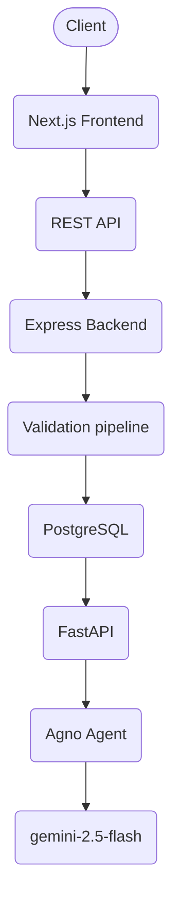

# ConstraintEngine
ConstraintEngine is an AI-powered architecture reasoning platform that analyzes software project requirements, extracts architectural constraints, and generates architecture recommendations while demonstrating production-oriented AI backend design patterns such as request validation, cost-aware processing, structured agent outputs, and context management.

## Project Demo
<video controls src="public/demo.mp4" title="ConstraintEngine Demo"></video>

## Architecture

---

Tech Stack

- Backend
  - Typescript
  - Node.js / Express.js
  - Zod

- Database
  - Postgresql / Prisma

- AI Layer
  - Fastapi
  - Agno
  - Gemini 2.5 Flash
  - Pydantic

- Frontend
  - Next.js
  - tailwind CSS

- Infrastructure
  - JWT (authentication)
  - REST API

---

Product & Engineering Features

### Product Features
- Project creation
- constraint extraction
- architecture recommendation
- architecture version tracking

### Engineering Features
- guest + authenticated user sessions
- structured AI outputs
- request validation pipeline
- product aware rate limiting
- context management

---

## Architectural Tradeoffs

<table>
  <tr>
    <th>Tradeoff</th>
    <th>Pros</th>
    <th>Cons</th>
  </tr>
  <tr>
    <td>Rejecting before AI Agent invocation</td>
    <td>Lower cost, cleaner database</td>
    <td>small llm preprocessing latency</td>
  </tr>
  <tr>
    <td>Save twice before and after AI agent response</td>
    <td>Retryable</td>
    <td>Additional DB write operation</td>
  </tr>
  <tr>
    <td>Custom rate limiter</td>
    <td>customizable, more control</td>
    <td>-</td>
  </tr>
  <tr>
    <td>Database as source of truth instead of agent framework attributes for context management</td>
    <td>More control</td>
    <td>Context management overhead on backend</td>
  </tr>
</table>

---

## Case Studies
1. [Designing AI Backend That Rejects Bad Requests Before They Reach The Agent](https://github.com/ShreelaxmiHegde/ConstraintEngine/blob/main/case-studies.md#1-designing-ai-backend-that-rejects-bad-requests-before-they-reach-the-agent)
2. [Designing Product-Aware Rate Limits Instead of Generic API Limits](https://github.com/ShreelaxmiHegde/ConstraintEngine/blob/main/case-studies.md#2-designing-product-aware-rate-limits-instead-of-generic-api-limits)
3. [Designing an AI Request Pipeline from Lowest to Highest Cost](https://github.com/ShreelaxmiHegde/ConstraintEngine/blob/main/case-studies.md#3-designing-an-ai-request-pipeline-from-lowest-to-highest-cost)

Source: [ConstraintEngine/case-studies](https://github.com/ShreelaxmiHegde/ConstraintEngine/blob/main/case-studies.md)

---

## License

This project is licensed under the MIT License.