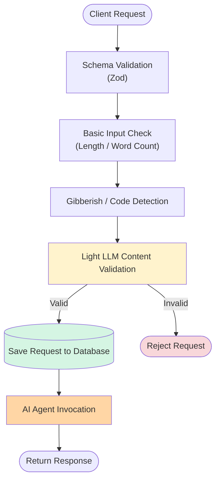
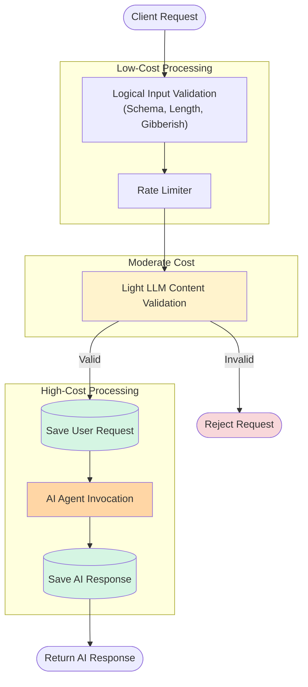

# ConstraintEngine
ConstraintEngine is an AI-powered full-stack application built for Software applications to extract constraints and analyze architecture.

<!-- ## Constraints simulated
- rate limiting
- latency measurement
- retry and failure recovery
- context window management
- async/queue based agentic cycle handling
- token/cost budgeting -->

Tech Stack

- Backend
  - Typescript
  - Node.js / Express.js
  - Zod
  - Postgresql / Prisma ORM

- Agentic Layer
  - Fastapi (server)
  - Agno (agentic framework)
  - LLM: "gemini-2.5-flash"
  - Pydantic (schema validations)

- Frontend
  - Next.js
  - tailwind CSS

- Infrastructure
  - JWT (authentication)
  - REST API

---

Features

### Project management
- user and guest user support
- project version & architecture tracking

### Project Constraint Extraction
- project requirement parsing
- structured constraint generation
- constraint validation using schemas

### Project Architecture analysis
- project architecture context management
- structured architecture recommendation
- flexible state modification on demand

---

## Case Studies

### 1. Designing AI Backend That Rejects Bad Requests Before They Reach The LLM
Every AI request has a monetary cost and processing latency.
Therefore, every unnecessary request that reaches the AI Agent wastes compute and pollutes stored conversations.

The problem became:
<b>How do we reject invalid requests before they consume expensive AI resources?</b>

Requirements:
- Reject malformed requests
- avoid unnecessary LLM calls
- prevent irrelevent conversations from entering storage
- keep validation latency low

So, both the request schema and semantic content should be validated and sanitized.

I designed this pipeline to achieve the goal:

Before the request hits the AI Agent, it should successfully pass all the checks.
Overall the workflow ordered from low to high expensive tasks by rejecting invalid requests early reducing latency, LLM cost and relevent data storing.

### 2. Designing Product-Aware Rate Limits Instead of Generic API Limits
In ConstraintEngine, Rate limiting applied 
- to LLM endpoints only
- before validating the request content and processing it

I implemented a custom Rate Limiter using Forward Window Algorithm based on client IP.

There are 2 endpoints which use the rate limiter:
1. project registration (POST `/projects/`)

here, the rate limiter limits max 2 project creation for a week timeframe. Because a user creating 3+ projects in a week is quite unusual and not reasonable.

2. architectural conversation (POST `/ask/`)

The rate limiter limits at most 5 conversational exchanges a day. The rate limiter counts the valid and invalid requests. So that it can prevent unnecessary content validation requests and promote genuine architectural discussions by users.

<u><b>Why generic rate limiting is insufficient here?</b></u>  
Generalizing limiting to 100 req/min for all endpoints unnecessary and not reasonable.

*Existing middleware like `express-rate-limiter` would have solved the problem, but implementing a light-weight forward-window limiter allowed the algorithm to remain transperent, customizable and sufficient to project's scale.

### 3. Designing an AI Request Pipeline from Lowest to Highest Cost
This is the structure of the AI agent endpoints in ConstraintEngine:

The pipeline is intentionally ordered from the cheapest operations to the most expensive. Each stage filters requests before they consume additional compute resources.

<u><b>Why to have rate limiter before the LLM content validation?</b></u>  
The Rate Limiter which runs before LLM content validation to prevent LLM cost on requests.

<u><b>Why LLM content validation? why not do at the time of actual agent processing?</b></u>  
This tradeoff comes with small preprocessing cost but significantly reduces unnecessary LLM requests and keeps the database clean. Its was possible to reject when the AI agent finds the request invalid but while reaching there, it already have increased latency, processing cost and have saved inconsistant data in the database.

<u><b>Why to save data before and after AI agent response (twice) not doing once after AI agent responds?</b></u>  
I had 2 reasonable approaches:
1. Approach1: Save Once
    - Pros: single DB call
    - Cons: Loses retry capability

2. Approach2: Additional write operation
    - Pros: Retryable, Recoverable
    - Cons: 2 DB call

  I chose the Approach2. Because it supports request recovery and retry workflows. i.e, if some internal error happens while AI agent invocation, then the user request also gone if we dont save it. So, here making the tradeoff between the DB calls and Request retry was reasonable.

### 4. Designing Database and Content Schema Compatible To AI Response

### 5. Managing Agent Context

### 6. Managing Agent Output and maintaining consistent structure throughout the application

## Tradeoffs Made

<table>
  <tr>
    <th>Tradeoff</th>
    <th>Pros</th>
    <th>Cons</th>
  </tr>
  <tr>
    <td>Rejecting before AI Agent invocation</td>
    <td>Lower cost, cleaner database</td>
    <td>small llm preprocessing latency</td>
  </tr>
  <tr>
    <td>Save twice before and after AI agent response</td>
    <td>Retryable</td>
    <td>Additional DB write operation</td>
  </tr>
  <tr>
    <td>Custom rate limiter</td>
    <td>customizable, more control</td>
    <td>-</td>
  </tr>
  <tr>
    <td>Database as source of truth instead of agent framework attributes for context management</td>
    <td>More control</td>
    <td>Context management overhead on backend</td>
  </tr>
</table>