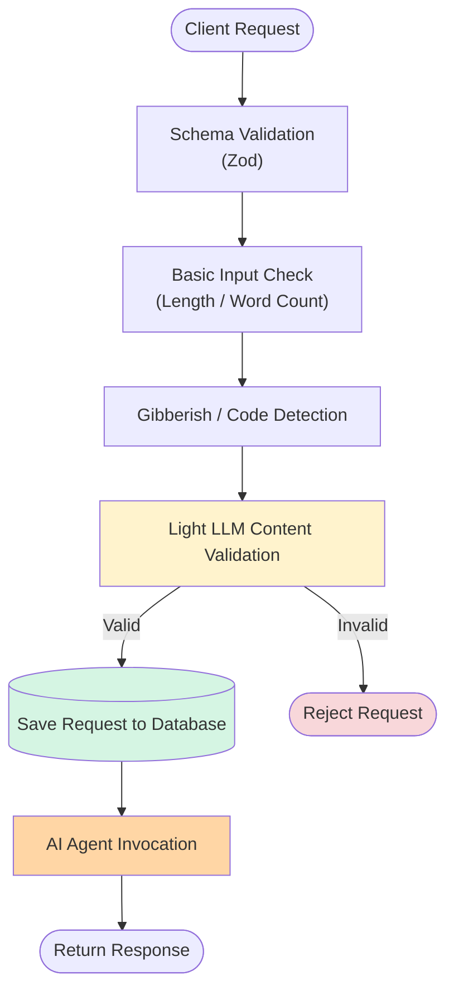
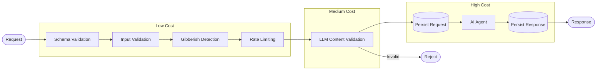

# Index
1. [Designing AI Backend That Rejects Bad Requests Before They Reach The Agent](https://github.com/ShreelaxmiHegde/ConstraintEngine/blob/main/case-studies.md#1-designing-ai-backend-that-rejects-bad-requests-before-they-reach-the-agent)
2. [Designing Product-Aware Rate Limits Instead of Generic API Limits](https://github.com/ShreelaxmiHegde/ConstraintEngine/blob/main/case-studies.md#2-designing-product-aware-rate-limits-instead-of-generic-api-limits)
3. [Designing an AI Request Pipeline from Lowest to Highest Cost](https://github.com/ShreelaxmiHegde/ConstraintEngine/blob/main/case-studies.md#3-designing-an-ai-request-pipeline-from-lowest-to-highest-cost)

---

## 1. Designing AI Backend That Rejects Bad Requests Before They Reach The Agent
Every AI request has a monetary cost and processing latency.
Therefore, every unnecessary request that reaches the AI Agent wastes compute and pollutes stored conversations.

The problem became:
<b>How do we reject invalid requests before they consume expensive AI resources?</b>

Requirements:
- Reject malformed requests
- avoid unnecessary LLM calls
- prevent irrelevent conversations from entering storage
- keep validation latency low

So, both the request schema and semantic content should be validated and sanitized.

I designed this pipeline to achieve the goal:

Before the request hits the AI Agent, it should successfully pass all the checks.
Overall the workflow ordered from low to high expensive tasks by rejecting invalid requests early reducing latency, LLM cost and relevent data storing.

---

## 2. Designing Product-Aware Rate Limits Instead of Generic API Limits
In ConstraintEngine, Rate limiting applied 
- to LLM endpoints only
- before validating the request content and processing it

I implemented a custom Rate Limiter using Forward Window Algorithm based on client IP.

There are 2 endpoints which use the rate limiter:
1. project registration (POST `/projects/`)

Limits project creation to 2/week. Because a user creating 3+ projects in a week is quite unusual and not reasonable.

2. architectural conversation (POST `/ask/`)

Limits conversations to 5/day including valid and invalid requests. So that it can prevent unnecessary content validation requests and promote genuine architectural discussions by users.

### <ins><b>Why generic rate limiting is insufficient here?</b></ins>  
Generic rate limiting (e.g., 100 requests/minute) treats every endpoint equally. In ConstraintEngine, each AI endpoint has different user behavior & business value so each requires its own rate-limiting policy.

**Existing middleware like `express-rate-limiter` would have solved the problem, but implementing a lightweight forward-window limiter allowed the algorithm to remain transparent, customizable and sufficient to project's scale.

---

## 3. Designing an AI Request Pipeline from Lowest to Highest Cost
This is the structure of the AI agent endpoints in ConstraintEngine:

The pipeline is intentionally ordered from the cheapest operations to the most expensive. Each stage filters requests before they consume additional compute resources.

### <ins><b>Why to have rate limiter before the LLM content validation?</b></ins>  
The Rate Limiter which runs before LLM content validation to prevent LLM cost on requests.

### <ins><b>Why LLM content validation? why not do at the time of actual agent processing?</b></ins>  
This tradeoff comes with small preprocessing cost but significantly reduces unnecessary LLM requests and keeps the database clean. Its was possible to reject when the AI agent finds the request invalid but while reaching there, it already have increased latency, processing cost and have saved inconsistant data in the database.

### <ins><b>Why to save data before and after AI agent response (twice) not doing once after AI agent responds?</b></ins>  
I had 2 reasonable approaches:
1. Approach1: Save Once
    - Pros: single DB call
    - Cons: Loses retry capability

2. Approach2: Additional write operation
    - Pros: Retryable, Recoverable
    - Cons: 2 DB call

  I chose the Approach2. Because it supports request recovery and retry workflows. i.e, if some internal error happens while AI agent invocation, then the user request also gone if we dont save it. So, here making the tradeoff between the DB calls and Request retry was reasonable.

<!-- ### 4. Designing Database and Content Schema Compatible To AI Response

### 5. Managing Agent Context

### 6. Managing Agent Output and maintaining consistent structure throughout the application -->
